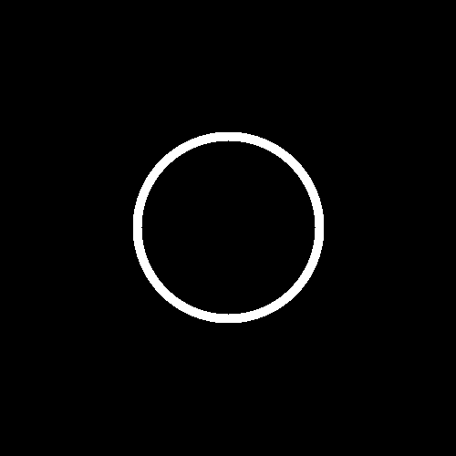
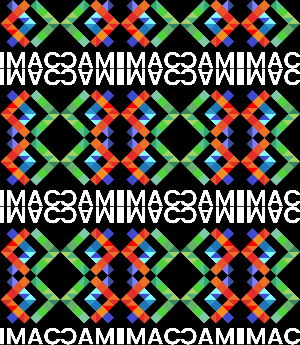
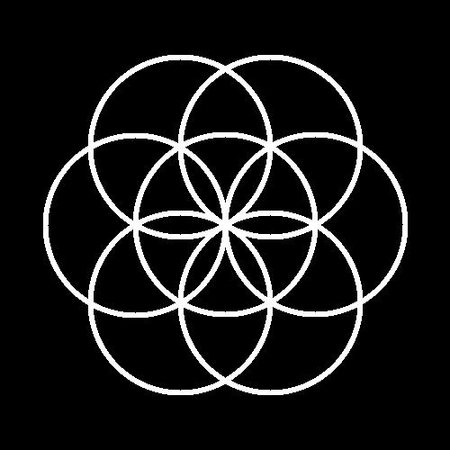
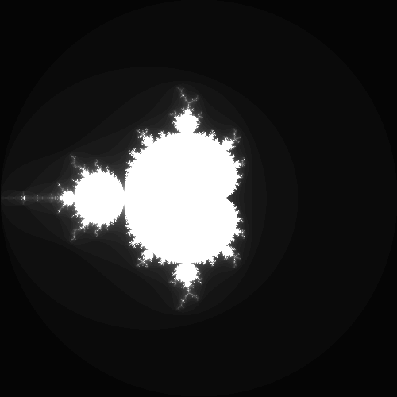

# Rapport Workshop C++ : Prog&Algo

Voici le compte-rendu des exercices réalisés durant la semaine. L'objectif était de manipuler des images pixel par pixel en C++ avec la librairie `sil`.

## Niveau 1 : Les bases (Couleurs)

### ⭐ Ne garder que le vert
J'ai parcouru tous les pixels pour mettre les canaux Rouge (`r`) et Bleu (`b`) à 0.

| Originale | Résultat |
|:---:|:---:|
|  |  |

### ⭐ Échanger les canaux
J'ai utilisé la fonction `std::swap` pour inverser simplement les valeurs des canaux rouge et bleu.

| Originale | Résultat |
|:---:|:---:|
|  |  |

### ⭐ Noir & Blanc
Pour avoir un niveau de gris, j'ai fait la moyenne des trois composantes : `(r + g + b) / 3`.

| Originale | Résultat |
|:---:|:---:|
|  |  |

### ⭐ Négatif
Il suffit d'inverser la valeur : `1 - couleur`. Les zones claires deviennent foncées et inversement.

| Originale | Résultat |
|:---:|:---:|
|  |  |

### ⭐ Dégradé
J'ai créé une image vide et calculé l'intensité du blanc selon la position `x`.
**Note :** Il fallait bien penser à convertir `x` en `float`, sinon la division entière donnait 0 soit une image noire.

| Résultat |
|:---:|
|  |

---

## Niveau 2 : Géométrie et effets

### ⭐⭐ Miroir
J'ai inversé l'image horizontalement en échangeant le pixel `x` avec le pixel opposé.
**Astuce :** Il faut s'arrêter à la moitié de la largeur (`width / 2`), sinon ça réinverse tout.

| Originale | Résultat |
|:---:|:---:|
|  |  |

### ⭐⭐ Rotation 90°
Comme les dimensions changent et largeur devient hauteur, j'ai créer une **nouvelle image** vide et copier les pixels en adaptant leurs coordonnées `(x, y) -> (y, x)`.

| Originale | Résultat |
|:---:|:---:|
|  |  |

### ⭐⭐ Luminosité (Gamma)
Pour éclaircir l'image tout en gardant les noirs j'ai utilisé la puissance `0.5` (racine carrée) sur chaque couleur.

| Originale | Résultat |
|:---:|:---:|
|  |  |

### ⭐⭐ Disque et Cercle
J'ai utilisé le théorème de Pythagore pour calculer la distance entre chaque pixel et le centre.
* **Disque :** Je colorie si `distance < rayon`.
* **Cercle :** Je colorie si la distance est égale au rayon.

| Disque | Cercle |
|:---:|:---:|
|  |  |

### ⭐⭐ Mosaïque
J'ai répété l'image 5 fois.
L'opérateur modulo `%` permet de revenir à 0 automatiquement dès qu'on dépasse la largeur de l'image de base.

| Originale | Résultat |
|:---:|:---:|
|  |  |

---

## Niveau 3 : Exercices avancés

### ⭐⭐⭐ Mosaïque Miroir
J'utilise le modulo `%` pour répéter l'image.
Pour la version miroir j'ai inversé les coordonnées d'une case sur deux.

| Mosaïque | Mosaïque Miroir |
|:---:|:---:|
|  |  |

### ⭐⭐⭐ Glitch
Cet effet glitch est le resultat d'echange de rectangle aléatoires dans l'image.
J'ai utilisé `#include "random.hpp"` pour générer des positions random et j'ai répété l'action 100 fois.

| Originale | Résultat |
|:---:|:---:|
|  |  |

### ⭐⭐⭐ Rosace
J'ai combiné l'exercice du cercle avec de la trigo.
J'ai utilisé `cos(angle)` et `sin(angle)` pour placer 6 cercles autour du centre.

| Résultat |
|:---:|
|  |

### ⭐⭐⭐ Mandelbrot (Fractale)
C'est une image générée mathématiquement avec les nombres complexes.
* **Note :** J'avais déjà vu sur cet algo pendant le workshop **"Esthétique et Algorithmique"**.
* **Difficulté :** Les pixels vont de 0 à 500 mais la fractale est entre -2 et 2. J'ai dû faire une conversion d'échelle pour qu'elle s'affiche.

| Résultat |
|:---:|
|  |

---

## Conclusion
Ce projet m'a permis de mieux comprendre le stockage des images (pixels, canaux RGB) et l'algorithmique en C++. C'était amusant de voir le résultat  direct de mon code. J'ai beaucoup aimé réaliser la fractale de Mandelbrot.

```